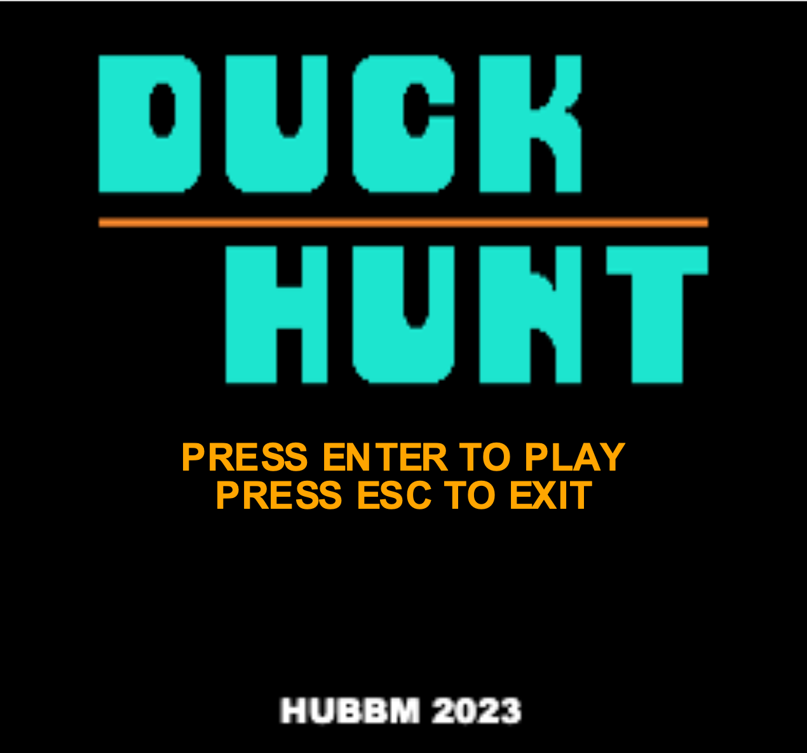
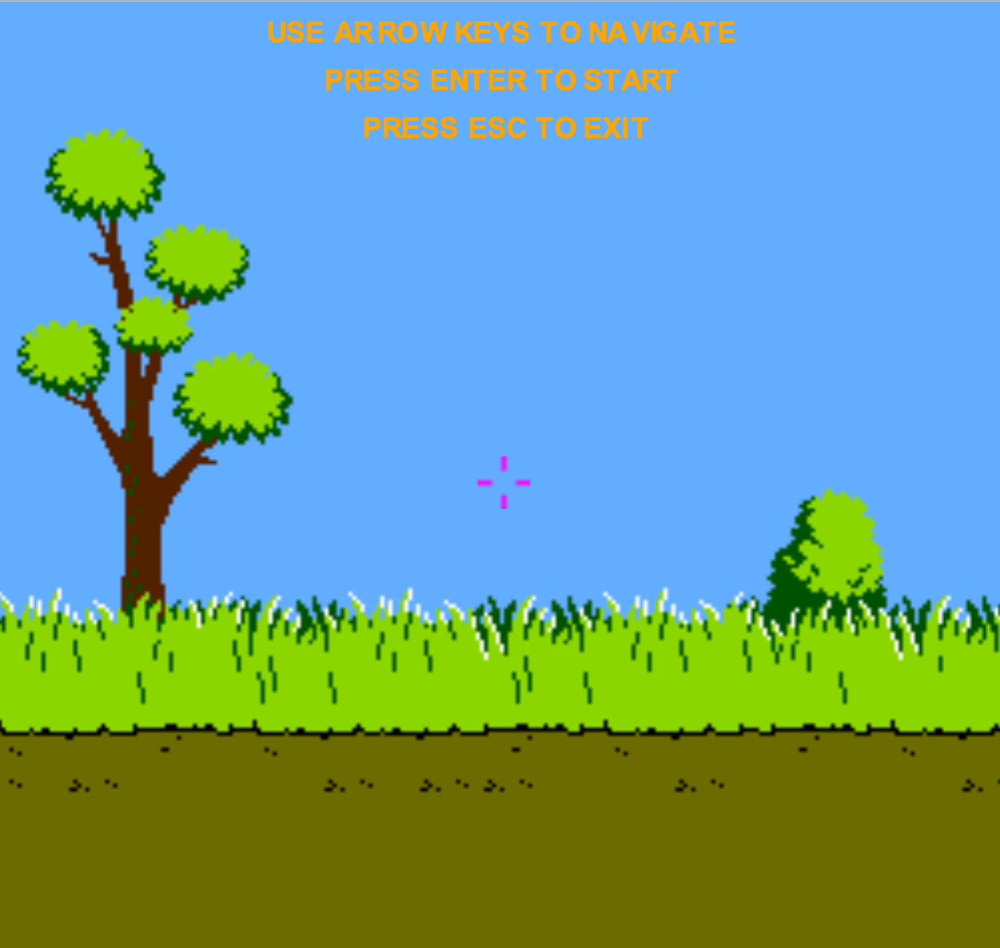
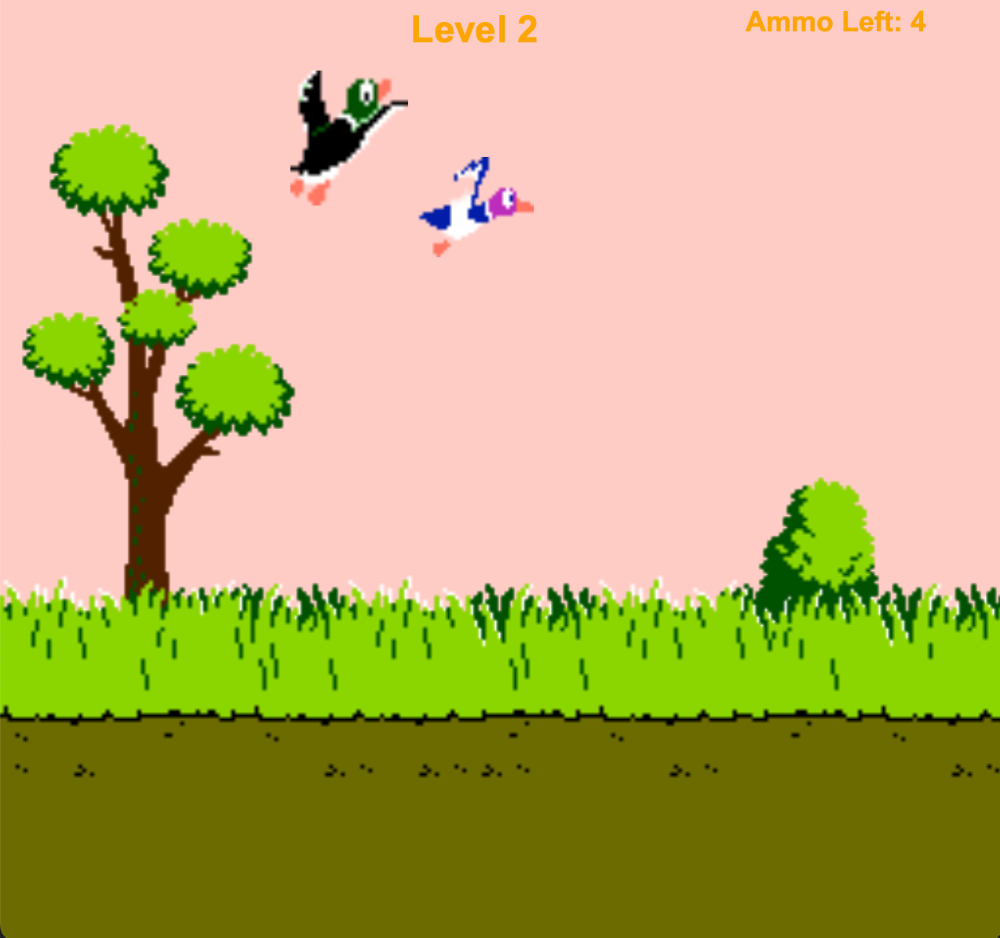

# DuckHunt Clone 🦆

Welcome to my DuckHunt Clone! This project is a modern recreation of the classic DuckHunt game, developed as a school assignment. It showcases my skills in game development, including animation, collision detection, and user interaction.

This project developed as a school assignment and is not intended for commercial use.

## Features

- **Classic Gameplay**: Enjoy the nostalgic experience of hunting ducks with updated graphics and mechanics.
- **Smooth Animations**: Realistic duck flight and shooting animations.
- **Scoring System**: Keep track of your score as you hit more ducks.
- **Customizing Gameplay**: Cursor and background changes.

## Technologies Used

- **JavaFX**: Structure and layout of the game.
- **Java**: Game logic and interactivity.

## How to Play

1. Clone the repository to your local machine.
2. Open and run `DuckHunt.java` in your favorite Java IDE.
3. Change the cursor and background as you like.
4. Use your mouse to aim and click to shoot the ducks.
5. Try to hit as many ducks as possible to complete the whole six levels!

## Installation

To run this game locally:

1. Clone the repository:
    ```bash
    git clone https://github.com/merttcetn/duckhunt-clone.git
    ```
2. Navigate to the project directory:
    ```bash
    cd duckhunt-clone
    ```
3. Run `DuckHunt.java` in your Java IDE.

## Screenshots








## Acknowledgments

- Inspired by the classic DuckHunt game by Nintendo.
- Special thanks to my school and instructors for their guidance and support.

Enjoy!


